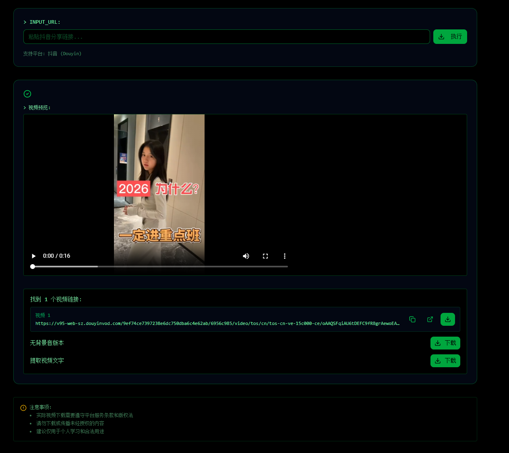
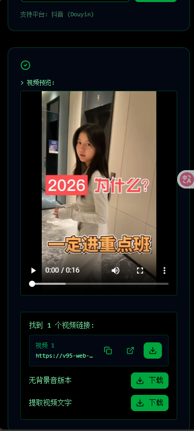

# 抖音视频下载与处理工具

一个功能强大的抖音视频下载和处理工具，支持视频下载、文字提取、人声分离等多种功能。提供现代化的 Web 界面和完整的 REST API 服务。

## 📱 效果展示

<div align="center">

### Web 界面效果


### 手机端效果


### 原视频演示
[点击查看原视频演示](https://github.com/sz-hacker/douyin_download/raw/main/docs/%E5%8E%9F%E8%A7%86%E9%A2%91.mp4)

### 去人声效果演示
[点击查看去人声效果演示](https://github.com/sz-hacker/douyin_download/raw/main/docs/%E5%8E%BB%E4%BA%BA%E5%A3%B0%E8%A7%86%E9%A2%91.mp4)

### 提取的文字内容
```
C,你为什么一定要进重点来呀?因为两个高智商的人是不会吵起来的。两个人发生矛盾,其中必有一方的智商冰下。所以你现在都没有跟同学发生过矛盾吗?将人赶路,不断一瞬。哦,高人生活,远离罗乐。
```

</div>

## 🚀 快速开始

### 方式一：自动拉取镜像（推荐）
```bash
# 使用 docker-compose 启动服务（会自动拉取镜像）
docker-compose -f docker/docker-compose.yml up -d
```

### 方式二：手动拉取镜像
```bash
# 先手动拉取镜像
docker pull ghcr.io/sz-hacker/douyin_download-frontend:latest
docker pull ghcr.io/sz-hacker/douyin_download-backend:latest

# 然后启动服务
docker-compose -f docker/docker-compose.yml up -d
```

## ⚠️ 注意事项

1. **法律合规**: 请确保下载和使用视频符合相关法律法规和平台服务条款
2. **版权保护**: 下载的视频仅供个人学习研究使用，请勿用于商业用途
3. **性能要求**: 
   - OCR 和 ASR 处理需要较长时间，请耐心等待
   - 建议使用 GPU 加速以提高处理速度
   - 首次使用 Whisper 需要下载模型文件（约 1.5GB）
4. **依赖安装**: 某些功能需要额外的依赖包，首次使用时会提示安装
5. **网络要求**: 视频下载和处理需要稳定的网络连接

## 📄 许可证

详见 [LICENSE](LICENSE) 文件。

## 🤝 贡献

欢迎提交 Issue 和 Pull Request！

## 📧 联系方式

如有问题或建议，请通过 Issue 反馈。

## ☕ 请作者喝咖啡

如果这个项目对您有帮助，欢迎请作者喝杯咖啡，支持项目的持续开发！

<div align="center">

### 微信赞赏


### 支付宝赞赏


</div>

感谢您的支持！🙏

---

## ⚖️ 免责声明

**重要提示：请在使用本工具前仔细阅读以下免责声明**

### 1. 软件状态
本软件按"现状"提供，不提供任何明示或暗示的保证，包括但不限于：
- 对适销性、特定用途适用性和非侵权性的保证
- 对软件功能、性能、准确性、可靠性、安全性或可用性的保证
- 对软件不会中断、无错误或缺陷的保证

### 2. 责任限制
在任何情况下，作者或版权持有人均不对以下事项承担责任：
- 因使用或无法使用本软件而导致的任何直接、间接、偶然、特殊、惩罚性或后果性损害
- 数据丢失、利润损失、业务中断、商誉损失或其他经济损失
- 因使用本软件而导致的任何法律后果或法律责任

### 3. 使用限制
- **仅供学习研究**: 本工具仅供个人学习、研究和教育目的使用
- **遵守法律法规**: 使用者必须遵守所在国家/地区的法律法规，包括但不限于：
  - 版权法和知识产权法
  - 数据保护法
  - 计算机安全法
- **遵守平台条款**: 使用者必须遵守相关视频平台的服务条款和使用协议
- **禁止商业用途**: 禁止将本工具用于任何商业目的或盈利活动
- **禁止非法用途**: 禁止使用本工具下载、传播或使用任何未经授权的内容

### 4. 用户责任
使用者明确理解并同意：
- 使用本工具的所有行为均由使用者自行决定和负责
- 使用者需自行判断下载内容的合法性和合规性
- 使用者需自行承担因使用本工具而产生的所有风险和责任
- 使用者需自行处理因使用本工具而产生的任何法律纠纷

### 5. 不承担责任
作者不对以下事项承担责任：
- 因违反平台服务条款而导致的账户封禁或其他后果
- 因下载或使用受版权保护内容而导致的任何法律后果
- 因使用本工具而导致的任何数据泄露、隐私侵犯或安全问题
- 因软件缺陷、错误或故障而导致的任何损失

### 6. 知识产权
- 本软件本身的知识产权归作者所有
- 通过本工具下载的视频、音频或其他内容的知识产权归原作者所有
- 使用者不得将下载的内容用于侵犯他人知识产权的用途

### 7. 服务可用性
- 作者不保证本工具能够持续、稳定地访问任何第三方平台
- 第三方平台可能随时更改其技术架构、API 或访问策略
- 本工具可能因平台更新而失效，作者不承担维护或更新的义务

### 8. 接受条款
通过使用本工具，您表示已阅读、理解并同意接受本免责声明的所有条款。如果您不同意本免责声明的任何部分，请立即停止使用本工具。

**再次提醒**: 使用本工具即表示您已充分理解并接受所有风险和责任。作者不对您的使用行为承担任何法律责任。
